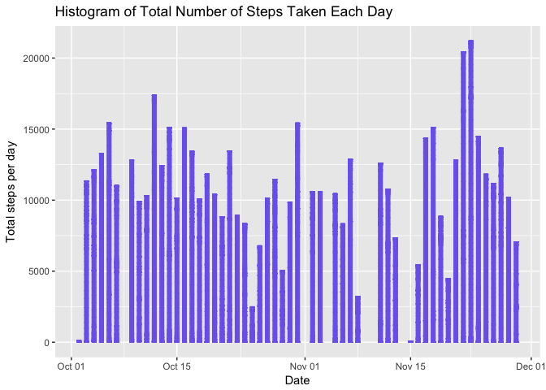
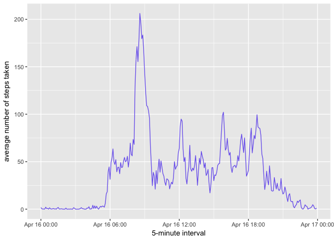
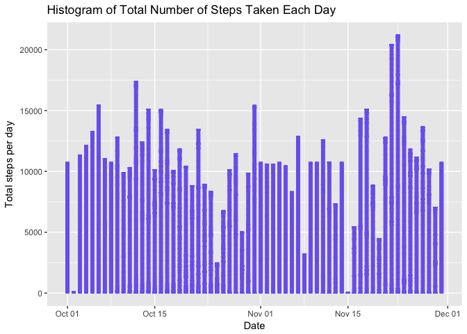
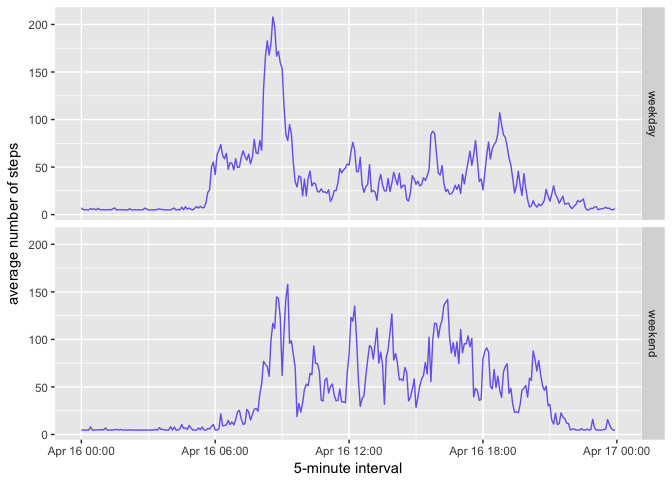

## Loading and preprocessing the data
##### Load the data (i.e. `read.csv()`)

```r
if (!file.exists('activity.csv')){
    unzip('activity.zip')
}
data <- read.csv('activity.csv', colClasses = c("numeric", "Date", "numeric"))
```
##### 2. Process/transform the data (if necessary) into a format suitable for your analysis

```r
noNA <- na.omit(data)
rownames(noNA) <- 1:nrow(noNA)
head(noNA)
```

```
##   steps       date interval
## 1     0 2012-10-02        0
## 2     0 2012-10-02        5
## 3     0 2012-10-02       10
## 4     0 2012-10-02       15
## 5     0 2012-10-02       20
## 6     0 2012-10-02       25
```

---


## What is mean total number of steps taken per day?
##### 1. Make a histogram of the total number of steps taken each day

```r
ggplot(noNA, aes(date, steps)) +
    geom_bar(stat = "identity", colour = "mediumslateblue", fill = "mediumslateblue", width = 0.5) +
    labs(title = "Histogram of Total Number of Steps Taken Each Day", x = "Date", y = "Total steps per day")
```

<!-- -->

##### 2. Calculate and report the **mean** and **median** total number of steps taken per day

```r
totalSteps <- tapply(noNA$steps, noNA$date, sum)

stepsByDayMean <- mean(totalSteps)
stepsByDayMedian <- median(totalSteps)
```
* Mean: 1.0766189\times 10^{4}
* Median:  1.0765\times 10^{4}

---

## What is the average daily activity pattern?

```r
averageStepsPerTimeBlock <- aggregate(steps ~ interval, data = noNA, FUN = mean)
averageStepsPerTimeBlock <- transform(averageStepsPerTimeBlock, interval_time = strptime(sprintf("%04d", interval),
    "%H%M"))
```

##### 1. Make a time series plot (i.e. `type = "l"`) of the 5-minute interval (x-axis) and the average number of steps taken, averaged across all days (y-axis)

```r
ggplot(data=averageStepsPerTimeBlock, aes(x=interval_time, y=steps)) +
    geom_line(color = "mediumslateblue", size = 0.5) +
    xlab("5-minute interval") +
    ylab("average number of steps taken")
```

<!-- -->

##### 2. Which 5-minute interval, on average across all the days in the dataset, contains the maximum number of steps?

```r
minterval <- which.max(averageStepsPerTimeBlock$steps)
mtime <- averageStepsPerTimeBlock[minterval,]$interval_time
```

* Max interval : 2018-04-16 08:35:00

---

## Imputing missing values
##### 1. Calculate and report the total number of missing values in the dataset (i.e. the total number of rows with `NA`s)

```r
sum(is.na(data))
```

```
## [1] 2304
```

##### 2. Devise a strategy for filling in all of the missing values in the dataset. The strategy does not need to be sophisticated. For example, you could use the mean/median for that day, or the mean for that 5-minute interval, etc.
Strategy is to use mean
##### 3. Create a new dataset that is equal to the original dataset but with the missing data filled in.

```r
dataImputed <- data
dataImputed$steps <- impute(data$steps, fun=mean)
```


##### 4. Make a histogram of the total number of steps taken each day


```r
ggplot(dataImputed, aes(date, steps)) +
geom_bar(stat = "identity", colour = "mediumslateblue", fill = "mediumslateblue", width = 0.5) +
labs(title = "Histogram of Total Number of Steps Taken Each Day", x = "Date", y = "Total steps per day")
```

```
## Don't know how to automatically pick scale for object of type impute. Defaulting to continuous.
```

<!-- -->

##### Calculate and report the **mean** and **median** total number of steps taken per day


```r
stepsByDayImputed <- tapply(dataImputed$steps, dataImputed$date, sum)

stepsByDayMeanImputed <- mean(stepsByDayImputed)
stepsByDayMedianImputed <- median(stepsByDayImputed)
```
* Mean (Imputed): 1.0766189\times 10^{4}
* Median (Imputed):  1.0766189\times 10^{4}

##### Do these values differ from the estimates from the first part of the assignment? What is the impact of imputing missing data on the estimates of the total daily number of steps?


```r
oldMean <- mean(totalSteps)
oldMedian <- median(totalSteps)
stepsByDayMeanImputed - oldMean
```

```
## [1] 0
```

```r
stepsByDayMedianImputed - oldMedian
```

```
## [1] 1.188679
```
Imputed mean of total steps taken per day is the same as the old one.
Imputed median of total steps taken per day is greater than the old one.

---

## Are there differences in activity patterns between weekdays and weekends?
##### 1. Create a new factor variable in the dataset with two levels -- "weekday" and "weekend" indicating whether a given date is a weekday or weekend day.


```r
dataImputed$weekdays <- factor(format(dataImputed$date, "%A"))
levels(dataImputed$weekdays) <- list(weekday = c("Monday", "Tuesday",
                                             "Wednesday",
                                             "Thursday", "Friday"),
                                 weekend = c("Saturday", "Sunday"))
levels(dataImputed$weekdays)
```

```
## [1] "weekday" "weekend"
```

##### 2. Make a panel plot containing a time series plot (i.e. `type = "l"`) of the 5-minute interval (x-axis) and the average number of steps taken, averaged across all weekday days or weekend days (y-axis). The plot should look something like the following, which was created using **simulated data**:


```r
avgDataImputed <- aggregate(steps ~ interval + weekdays, data = dataImputed, FUN = mean)
avgDataImputed <- transform(avgDataImputed, interval_time = strptime(sprintf("%04d", interval),
    "%H%M"))

ggplot(avgDataImputed, aes(interval_time, steps)) +
    geom_line(color = "mediumslateblue", size = 0.5) +
    facet_grid(weekdays ~ .) +
    xlab("5-minute interval") +
    ylab("average number of steps")
```

<!-- -->
